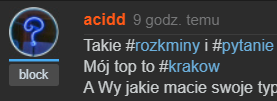
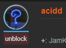
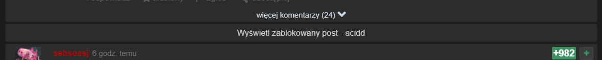
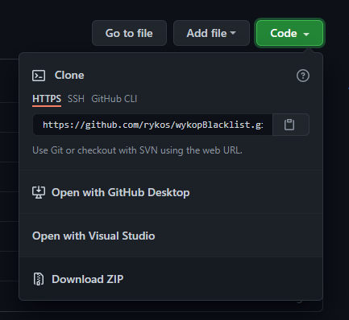
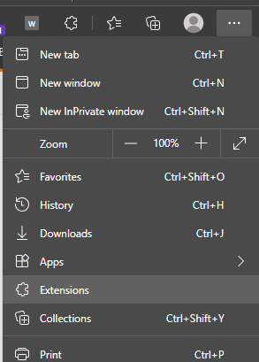
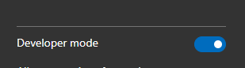
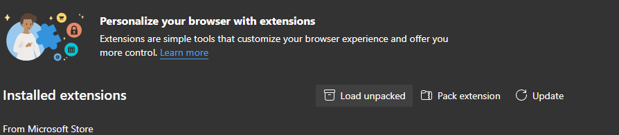
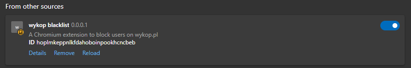

# Wykop Blacklist
#### Rozszerzenie chromium do wykopu tworzy czarną liste po stronie użytkownika dzięki czemu jest ona wstanie pomieścic znacznie więcej użytkowników
> Konto wykop nie jest wymagane a lista synchronizuje się z kontem google jeśli jest dostępne

## Zastosowanie
#### Każdy użytkownik posiada przycisk do zablokowania pod avatarem

#### Po zablokowaniu przycisk zmieni się w przycisk do odblokowania

#### Posty zablokowanych użytkowników zostaną schowane i pokazują się dopiero po kliknięciu na nie

#### Komentarze użytkowników działają na tej samej zasadzie

  
Instalacja ręczna

  
  ### 1. Pobierz projekt i go rozpakuj
  
  ### 2. Otwórz zakladkę rozszerzenia
  
  ### 3. Włącz tryb dewelopera
  >znajduje się w lewym dolnym rogu
  

  ### 4. Załaduj dodatek
  
  ### 5. Gotowe

  

